# CGRA 2020/2021

## Group T03G05

## Project Notes

(add your main observations/remarks about your experiments here, in a bulleted list, and remove this line. Some examples below)

- In exercise 1 we observed X
- In exercise 2 we had difficulties in Y

Ideias para escever nesta parte: 
- Falar das dificuldades em ter a WaterSurf sem o "loop quebrado"
- Arranjar os melhores valores para a aleatoriedade das rochas e das algas
- Falar da maneira como temos a opção de noite e dia na nossa cena

For the 7th point of the Part B of the Project we implemented:

- 7.1 - "Algas";
- 7.5 - "MyAnimatedFish - Animação de outros peixes";
- 7.6 - "Shader do Peixe Melhorado".

## Screenshots
### 1 - MyFish

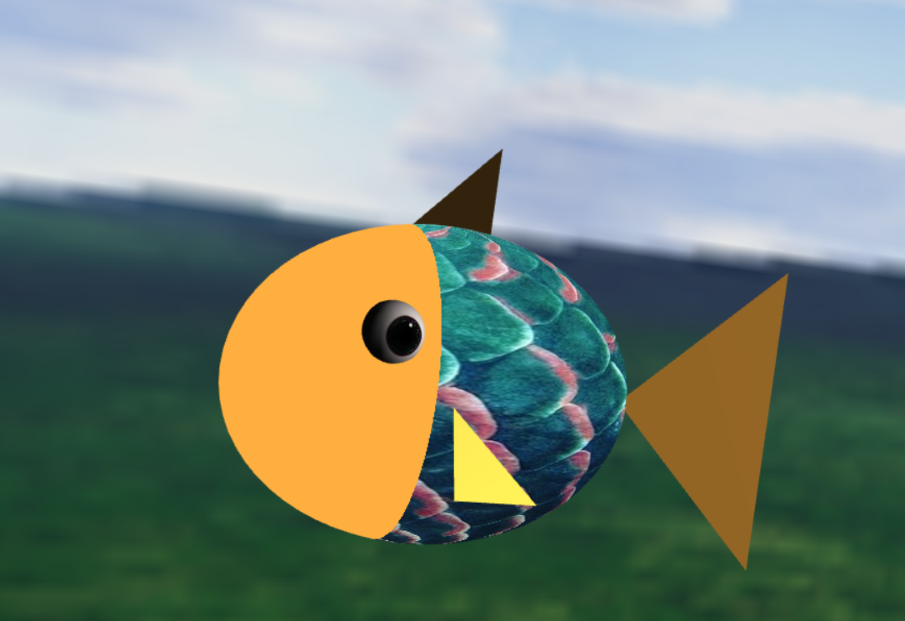

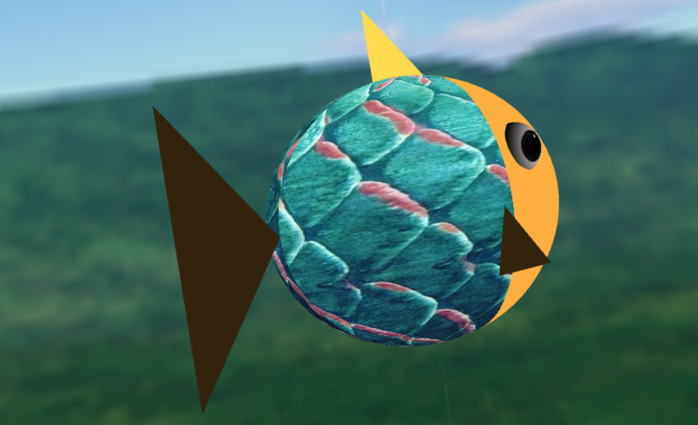

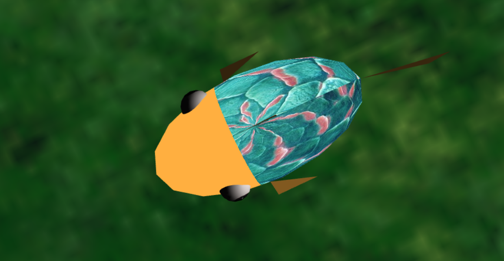

### 2 - Sea Floor and Nest

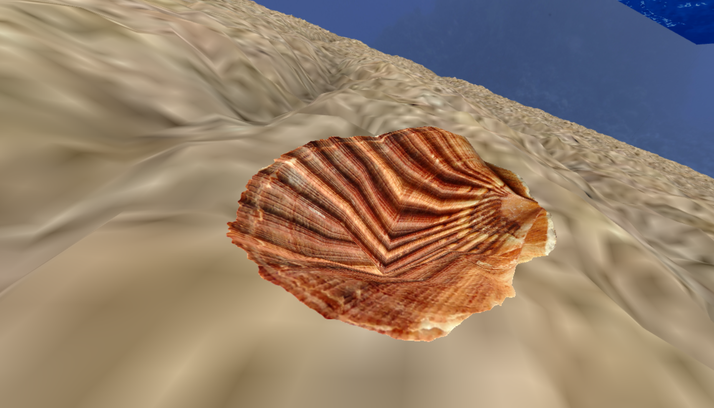

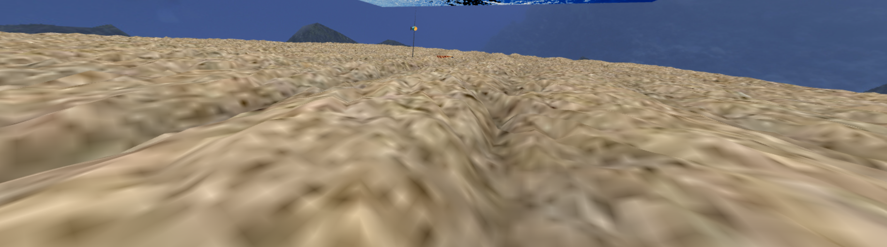
### 3 - Water Surface

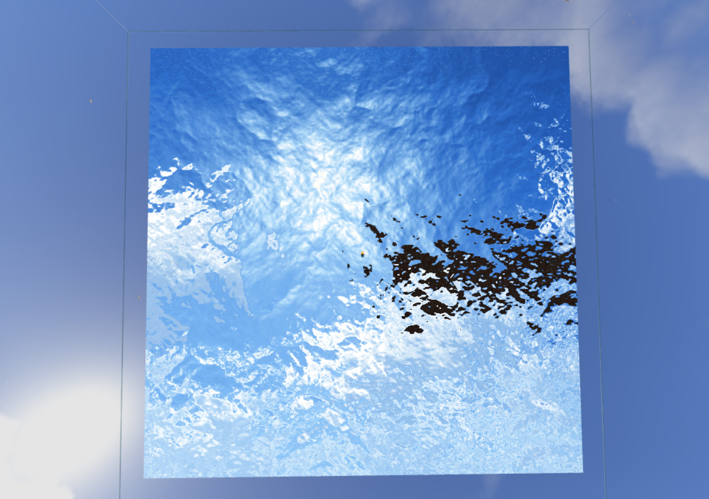

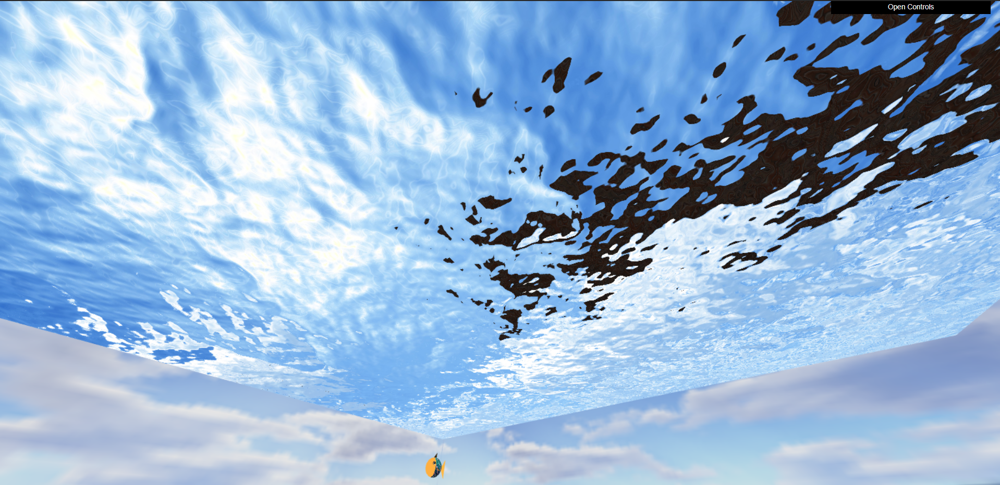

### 4 - Rocks

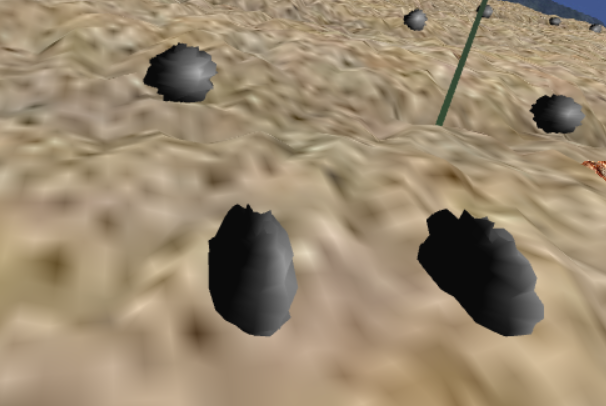

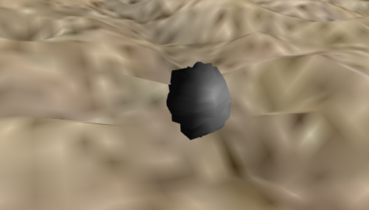

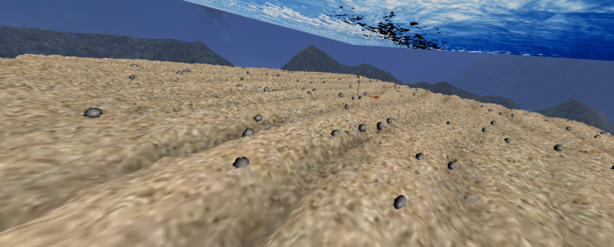

### 5 - Pillars

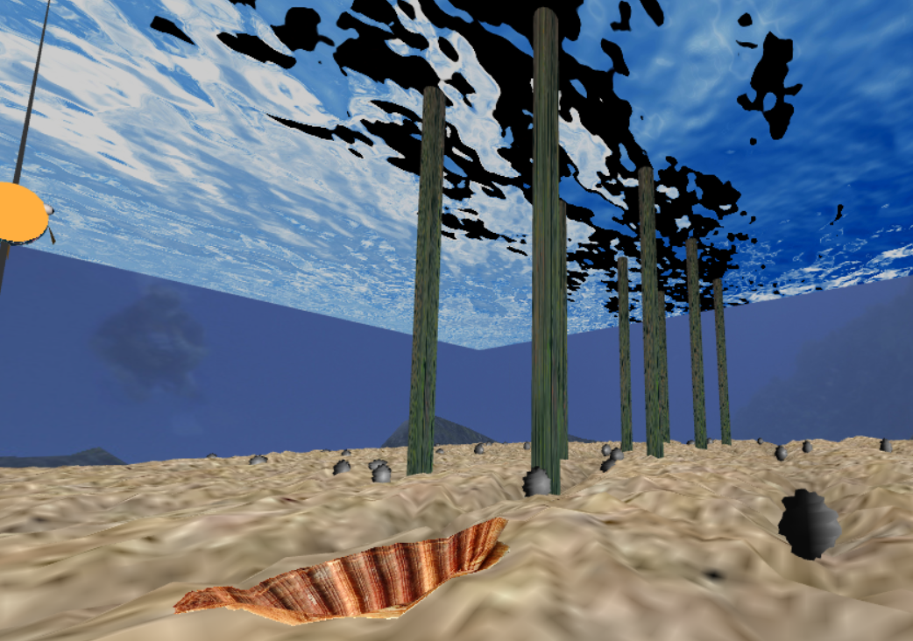

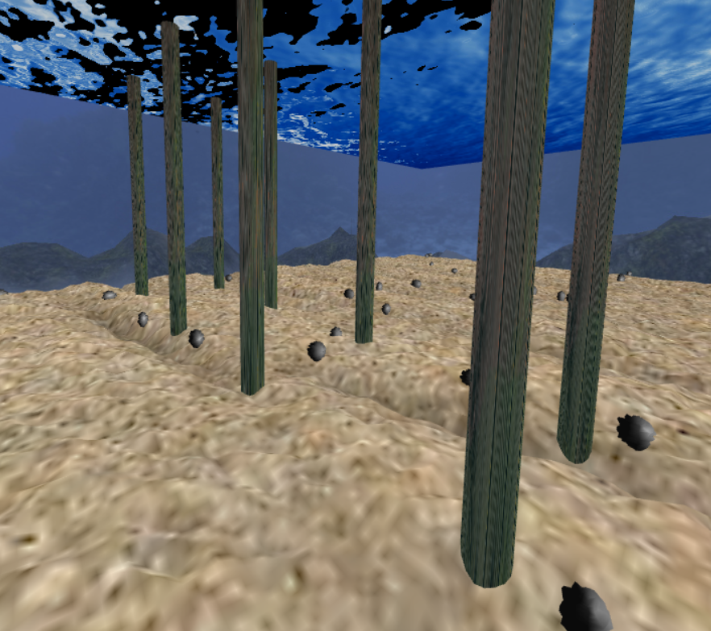

### 6 - Other scene elements

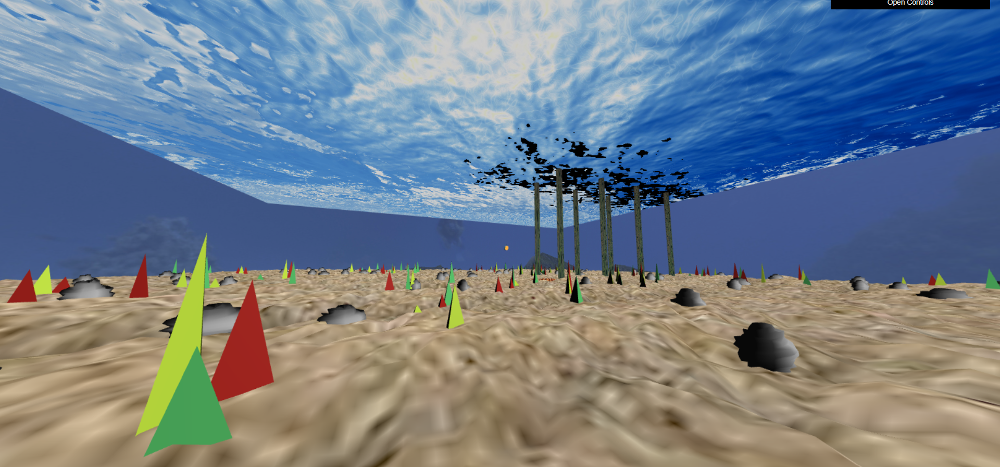

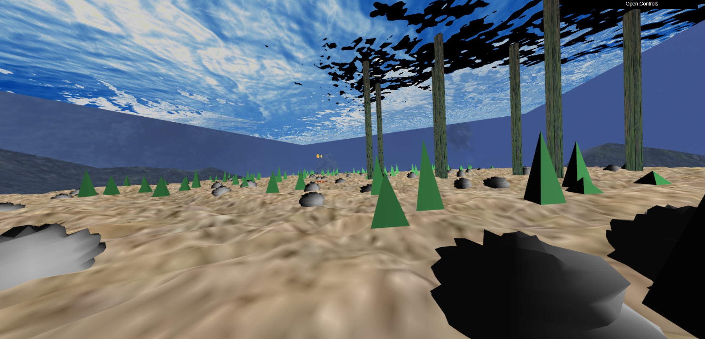

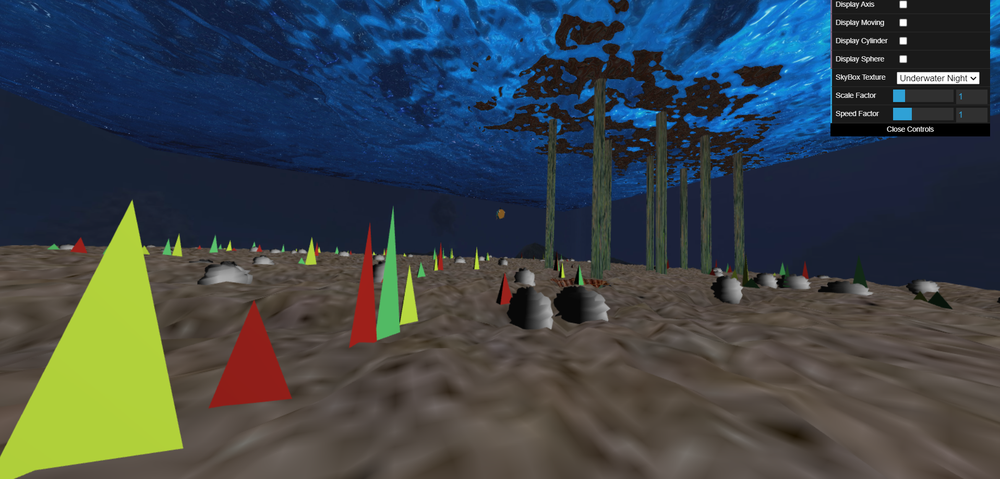

### 7 - Fish Interaction with rocks

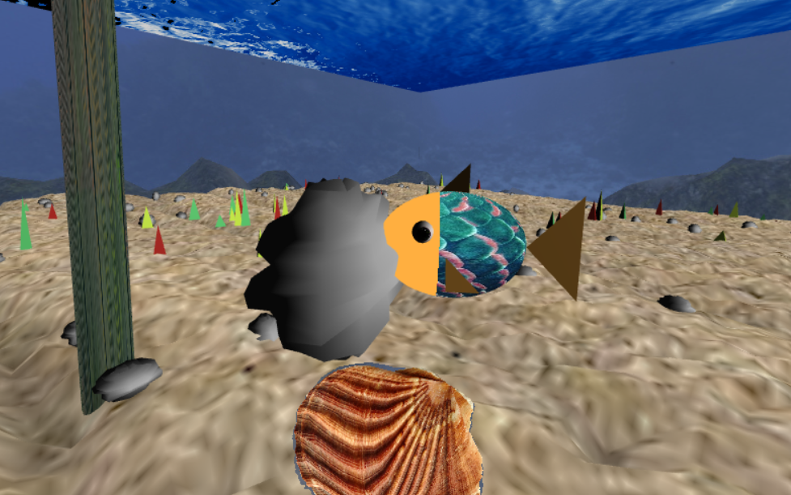

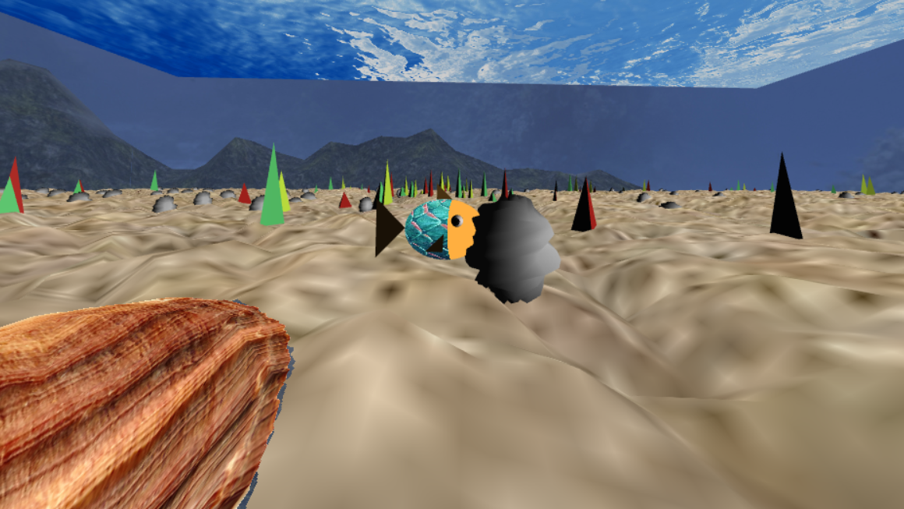

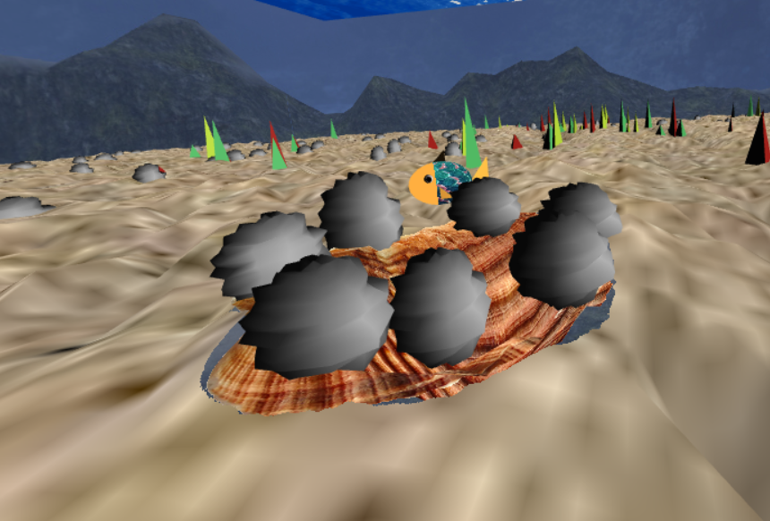

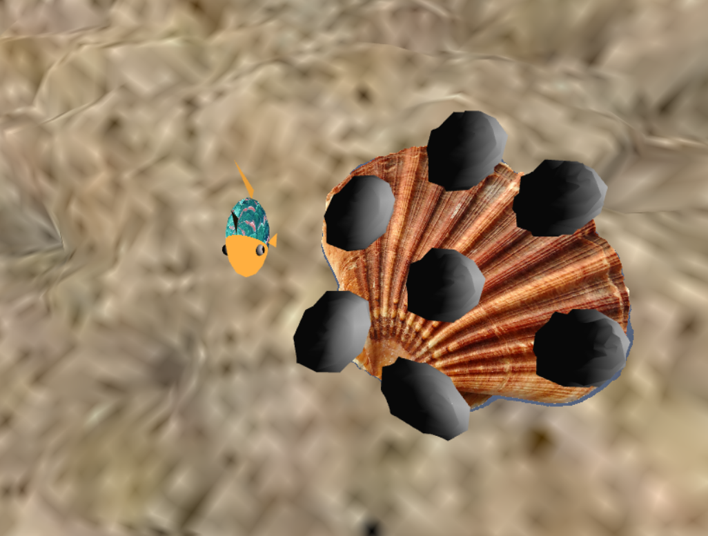

### 8 - Addicional Functionalities