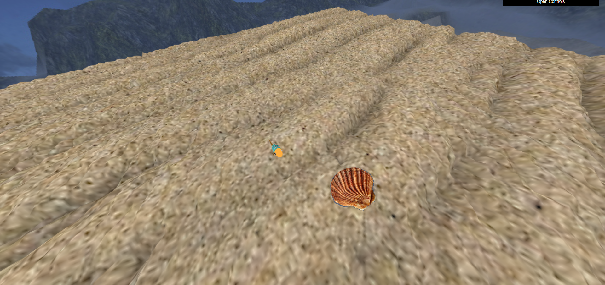
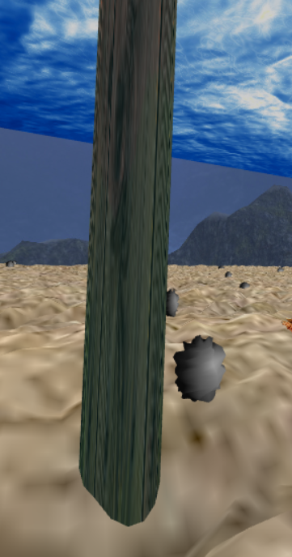

# CGRA 2020/2021

## Group T03G05
 

| Name                | Number    | E-Mail               |
| ------------------- | --------- | -------------------- |
| Ana Matilde Barra   | 201904795 | up201904795@fe.up.pt |
| Lucas Calvet Santos | 201904517 | up201904517@fe.up.pt |

 

## Project Notes

### Part A of the Project:
 - We had some difficulties while developing the Cylinder, especifically in the mapping of the textures. Eventually we were able to implement it after some time.

### Part B of the Project:

- We had to reflect for some time in order to define the best values for the 'randomness' of the algae and rock positions, but in the end we were able to find values that we are satisfied with;
- After some difficulties in defining the "waterSurface" loop, we were also able to define the shader in a way that the loop doesn't appear to be "broken" and we are very happy with the end result;
- In the fish nest there are only 7 predefined positions for placing the rocks. As such, you can only place 7 rocks in the nest. To empty the nest, you have to refresh the page;
- We wanted to implement an "additional feature" of our own, so we ended up making a night-day option for the scene (controllable trough the interface - through the selection of the cubemap texture), that influences the lighting of the scene, the cubemap and also the image used to represent the waterSurface.

For the 7th point (additional functionalities) we implemented:

- 7.1 - "Algas";
- 7.5 - "MyAnimatedFish - Animação de outros peixes";
- 7.6 - "Shader do Peixe Melhorado".

### Textures and Images

All the textures and images not provided by the teachers were either obtained by searching online for 'copyright free' images or by editing the ones that we received through the U.C.'s Moodle Page.

 

## Screenshots
### 1 - MyFish

### 2 - Sea Floor and Nest

### 3 - Water Surface

### 4 - Rocks

### 5 - Pillars

### 6 - Other scene elements

### 7 - Fish Interaction with rocks

### 8 - Addicional Functionalities

