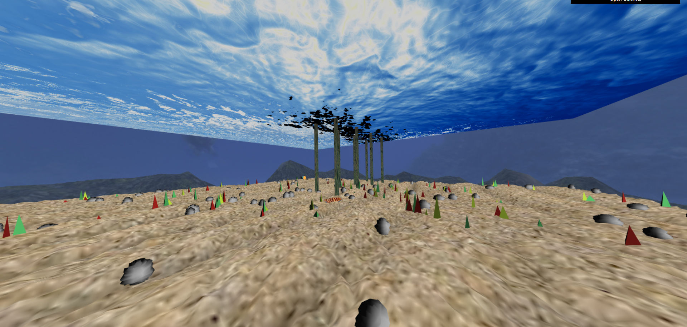

# CGRA 2020/2021

## Group T03G05

## Project Notes

(add your main observations/remarks about your experiments here, in a bulleted list, and remove this line. Some examples below)

- In exercise 1 we observed X
- In exercise 2 we had difficulties in Y

## Screenshots
### 1 - MyFish

### 2 - Sea Floor and Nest

### 3 - Water Surface

### 4 - Rocks

### 5 - Pillars

### 6 - Other scene elements

